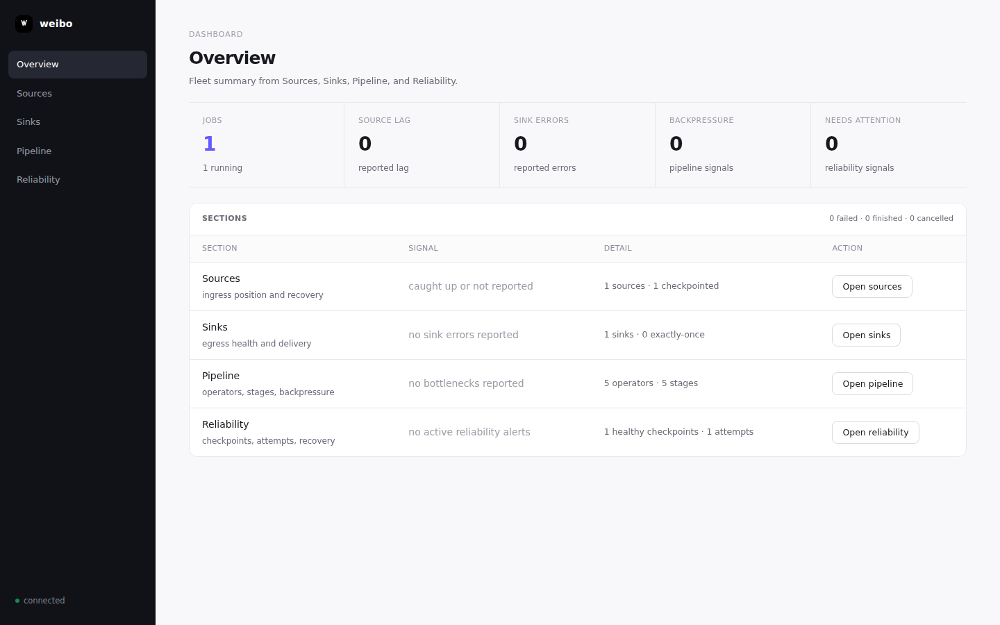
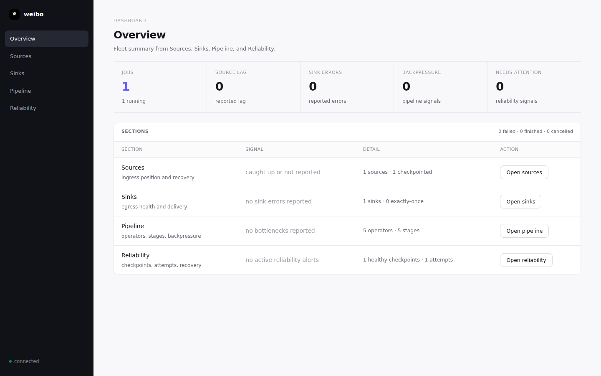
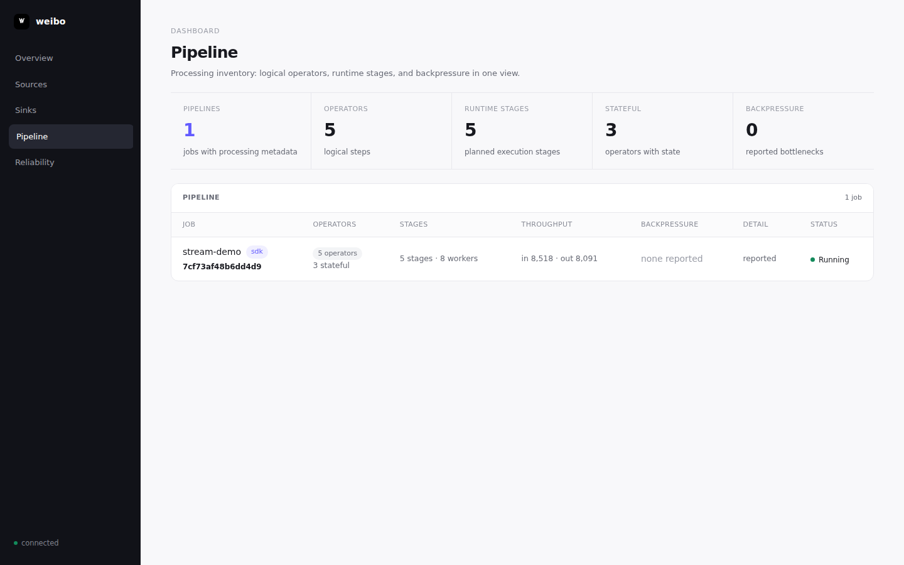
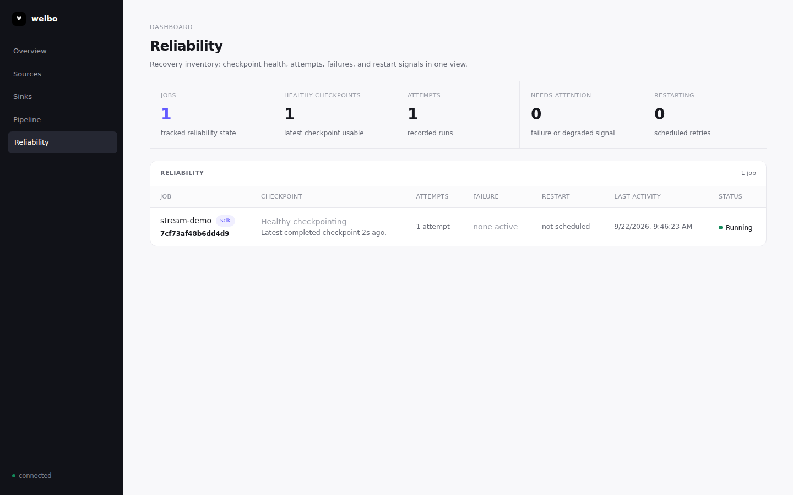
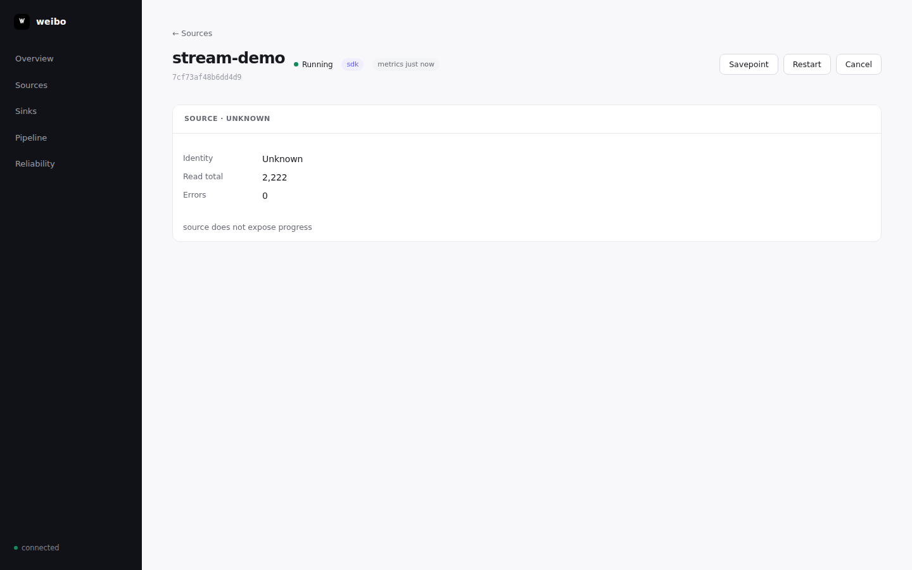

# Weibo Dashboard

The Weibo control-plane web UI. A single self-contained HTML page (inline CSS/JS, no external assets) embedded in the controller binary via `//go:embed` — no build step or static file deployment needed. This doc tracks what's been implemented so far and is updated as the dashboard evolves.

## Run

```sh
cd control && go run ./cmd/weibo dashboard        # starts controller + opens UI at :9000
go run ./cmd/weibo dashboard -no-open             # headless
```

Dashboard: http://localhost:9000 — API auth via `-auth-token` (env
`WEIBO_AUTH_TOKEN`) or hashed tokens via `-auth-token-sha256` (env
`WEIBO_AUTH_TOKEN_SHA256`). Empty auth is allowed for loopback; wildcard
listens require `-allow-open-public`.

### See it live with a real job

`scripts/dashboard-demo.sh` builds the [`examples/stream-demo`](../examples/stream-demo)
job image, boots the dashboard, and submits it as a continuously-running
pipeline (source → filter → keyBy → window → reduce → sink) so there's
something real to look at instead of an empty UI:

```sh
make dashboard-demo          # or: ./scripts/dashboard-demo.sh
```

It prints the dashboard URL and leaves both the dashboard and the job
running until you press Ctrl-C, at which point it tears the job container
down. For a scripted pass/fail check of the same read path (used in CI), see
`make dashboard-e2e` instead.

## Screenshots

Overview — fleet summary across all sections:



Sources — ingress identity, position, lag, read/error counters:



Pipeline — operators, runtime stages, throughput, backpressure:



Reliability — checkpoint health, attempts, restart signals:



Job detail — drilling into a single job's source:



These were captured from a live `stream-demo` job started with
`scripts/dashboard-demo.sh`, not mockups.

## Code layout

| Path | Role |
| ---- | ---- |
| `control/ui/ui.go`       | `//go:embed index.html logo.png`; serves the SPA at `/` and the logo |
| `control/ui/index.html`  | The whole dashboard (SPA, inline CSS/JS) |
| `control/api/api.go`     | REST server; dashboard talks to `/jobs`, `/jobs/{id}/...`, `/validate` |
| `docs/dashboard-data-contract.md` | Source-of-truth inventory for dashboard endpoints and fields |

The dashboard is a plain-JS SPA. The current visible router is intentionally reduced to `#/sources` plus source detail (`#/job/{id}`) while the dashboard is redesigned section-by-section. All rendering is self-contained in the embedded page.

## Implemented so far

### Layout & navigation
- **Sidebar** — compact dark navigation with section-by-section entries for Overview, Sources, Sinks, Pipeline, and Reliability. Connection status appears in the footer.
- **Token auth** — on a 401 the UI drops to a token prompt, validates it via `POST /auth`, and stores it in `localStorage`. Read-only hashed tokens can inspect the dashboard but cannot submit, delete, cancel, restart, or savepoint jobs.

### Target sections
- **Overview** — quick health check, rebuilt last from other section summaries.
- **Sources** — ingress identity, position, lag, read rate, errors, checkpoint participation.
- **Pipeline** — operators + runtime stages + backpressure in one processing view.
- **Sinks** — egress destination, records written, errors, delivery guarantee.
- **Reliability** — checkpoints, runs, diagnostics, logs, recovery actions.

### Current visible dashboard
- **Section-by-section navigation** — the sidebar exposes `Overview`, `Sources`, `Sinks`, `Pipeline`, and `Reliability`.
- **Overview** — default landing page summarizing job count, source lag, sink errors, pipeline backpressure, and reliability attention signals from the section summaries.
- **Sources list** — shows each job, source identity, live/static position, reported lag, read/error counters, checkpoint/recovery signal, and current job status.
- **Sinks list** — shows each job, sink destination, records written, sink errors, derived delivery guarantee, checkpoint/recovery signal, and current job status.
- **Pipeline list** — shows logical operators, runtime stages, worker count, throughput totals, stateful operators, and reported backpressure signals.
- **Reliability list** — shows checkpoint health, attempts, failures, restart schedule, last activity, and current job status.
- **Source/Sink/Pipeline/Reliability detail** — clicking a job opens the matching detail view. Other panes remain hidden until intentionally redesigned.
- **Normalization layer** — rendering uses `normalizeSources`, `normalizeSinks`, `normalizeOperators`, `normalizeStages`, `normalizeCheckpoints`, and `deriveDelivery` with existing missing-data fallbacks so the UI does not guess when live `/describe`, `/state`, or `/metrics` is unavailable.

## How to update this doc

Append new items under "Implemented so far" whenever a change lands. Keep it brief — one line per feature.
